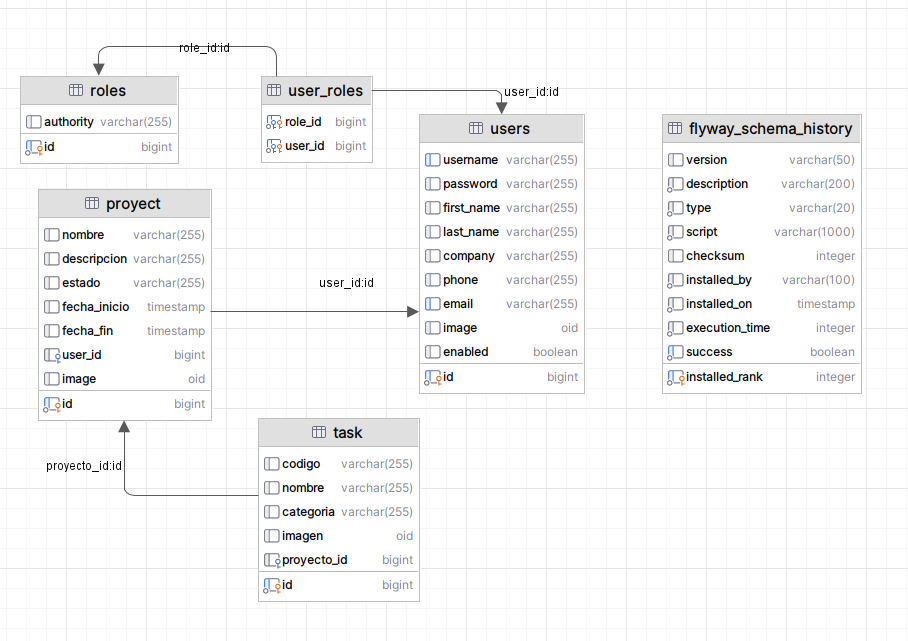

# PRUEBA LVL CONSULTING

## Descripción

Este proyecto es una aplicación desarrollada en Java utilizando Spring Boot, Maven y PostgreSQL. La aplicación permite
gestionar proyectos y tareas, incluyendo la creación, actualización, eliminación y filtrado de proyectos y tareas.

## Estructura del Proyecto

El proyecto está organizado en los siguientes paquetes:

- `controller`: Contiene los controladores REST para manejar las solicitudes HTTP.
- `dto`: Contiene las clases de transferencia de datos (DTO) para las solicitudes y respuestas.
- `entity`: Contiene las entidades JPA que representan las tablas de la base de datos.
- `repository`: Contiene los repositorios JPA para acceder a la base de datos.
- `service`: Contiene las clases de servicio que implementan la lógica de negocio.
- `config`: Contiene las configuraciones de la aplicación, incluyendo la configuración de transacciones.

## Requisitos

- Java 17 o superior
- Maven 3.6.3 o superior
- PostgreSQL 12 o superior

## Diagrama de la Base de Datos



## Configuración de la Base de Datos

Ejecutaremos este docker-compose para levantar un contenedor de PostgreSQL con la configuración necesaria para la
aplicación.

```yaml
services:
  postgres:
    image: postgres:16.0
    container_name: postgres_db
    ports:
      - "5432:5432"
    environment:
      POSTGRES_USER: omerSolutions
      POSTGRES_PASSWORD: peru2020
      POSTGRES_DB: test-backendJava
    volumes:
      - postgres_data:/var/lib/postgresql/data
    networks:
      - backend
volumes:
  postgres_data:

networks:
  backend:
    driver: bridge
```

## Ejecución

Para ejecutar la aplicación, utiliza el siguiente comando:

1. Clona el repositorio

```bash
git clone https://github.com/OmerJuve2023/MultipleJDBCClient.git
```

2. Compila y empaqueta el proyecto usando Maven

```bash
mvn clean install
```

3. Ejecuta la aplicación

```bash
mvn spring-boot:run
```

## Pruebas con Postman

Puedes importar la colección de Postman para probar los endpoints de la aplicación.

### Configuracion

1. Crear las variables globales `session_cookie`,`username` y `password` en Postman.

   | Variable        | Type    | Initial value         | Current value         |
   |-----------------|---------|-----------------------|-----------------------|
   | session_cookie  | default |                       |                       |
   | username        | default | user01@gmail.com       | user01@gmail.com       |
   | password        | default | rafael                | rafael                |

2. En el script de cada coleccion esta el siguiente script para obtener el token de autenticacion

```javascript
if (!pm.globals.get('session_cookie')) {
    // Realiza la solicitud de inicio de sesión
    pm.sendRequest({
        url: 'http://localhost:8080/api/auth/login',
        method: 'POST',
        body: {
            mode: 'formdata',
            formdata: [
                {
                    key: 'username',
                    value: pm.globals.get("username")
                },

                {
                    key: 'password',
                    value: pm.globals.get("password")
                }
            ]
        }
    }, function (err, res) {
        if (err) {
            console.log(err);
            return;
        }
        var cookie = res.headers.get('Set-Cookie');
        pm.globals.set('session_cookie', cookie);
    });
}
```

## Swagger

La documentación de la API se puede encontrar en `http://localhost:8080/swagger-ui/swagger-ui/index.html#/`.

La aplicación se ejecutará en `http://localhost:8080`.